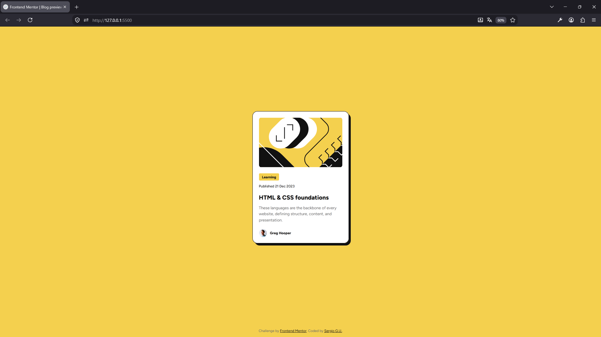

# Frontend Mentor - Blog preview card solution

This is a solution to the [Blog preview card challenge on Frontend Mentor](https://www.frontendmentor.io/challenges/blog-preview-card-ckPaj01IcS).

## Table of contents

- [The challenge](#the-challenge)
- [Screenshot](#screenshot)
- [Links](#links)
- [My process](#my-process)
  - [Built with](#built-with)
  - [What I learned](#what-i-learned)
  - [Continued development](#continued-development)
  - [AI Collaboration](#ai-collaboration)
- [Author](#author)

### The challenge

Users should be able to:

- See hover and focus states for all interactive elements on the page.
- View the optimal layout depending on their device's screen size (Mobile & Desktop) seamlessly.

### Screenshot



### Links

- Solution URL: [https://github.com/Segarur21/Blog-preview-card-main](https://github.com/Segarur21/Blog-preview-card-main)
- Live Site URL: [https://segarur21.github.io/Blog-preview-card-main/](https://segarur21.github.io/Blog-preview-card-main/)

## My process

### Built with

- Semantic HTML5 markup (`<article>`, `<time>`, etc.)
- CSS custom properties (`:root` variables)
- Flexbox for global alignment
- Relative units (`rem`) with `font-size: 62.5%` base setup
- **Fluid responsive design without `@media` queries**

### What I learned

In this project, I strengthened my knowledge of semantic HTML structures and learned how to build a fluid responsive layout for both mobile and desktop views without using any media queries, handling constraints with `width: calc(100vw - 4.8rem)`, `min-width`, and `max-width`.

```html
<article class="card">
  
  <h1 class="title">
    <a href="#" class="title-link">HTML & CSS foundations</a>
  </h1>
</article>
```
```css
.card {
  max-width: 384px;
  min-width: 327px;
  width: calc(100vw - 4.8rem);
}

.title-link:hover {
  color: var(--yellow);
  cursor: pointer;
}
```
### Continued development

In future projects, I want to keep practicing layout techniques using CSS Grid and explore micro-interactions.

### AI Collaboration

During this project, I collaborated with Gemini to:

- Debug layout issues and inline-block display behaviors.
- Structure Git commit messages and maintain best practices.
- Format and structure this README file using proper Markdown syntax for GitHub.

## Author

- Frontend Mentor - [@Segarur21](https://www.frontendmentor.io/profile/Segarur21)
- GitHub - [Sergio G.U.](https://github.com/Segarur21)